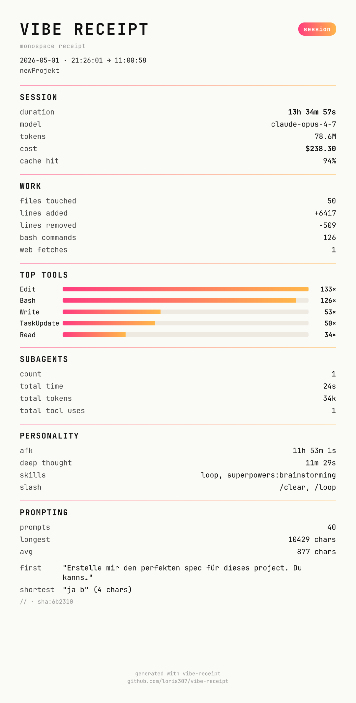
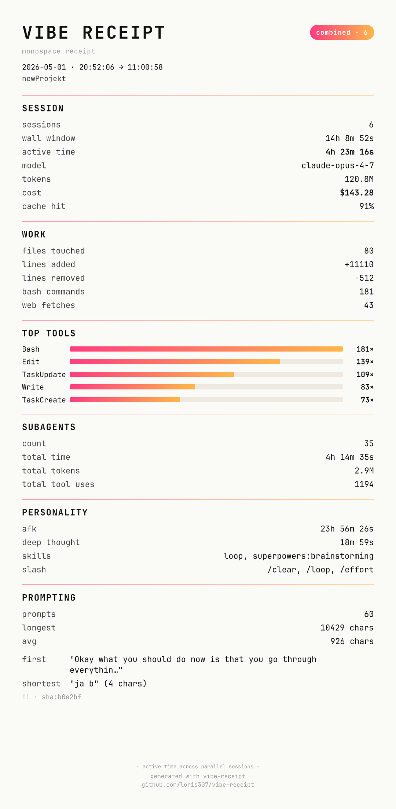

# vibe-receipt

> A beautiful paper-receipt card for every Claude Code & Codex CLI session.
> Tokens, cost, files touched, deep-thought time, ESC-rage — all in a screenshot you can actually share.

[](LICENSE)


<p align="center">
  
</p>

**100% local.** No upload, no telemetry, no auth. Reads your existing session logs and renders a PNG you can drop in a tweet, story, or video.

---

## Quickstart (60 seconds)

You need Node 20+ on your machine. Check with `node --version`.

```bash
# 1. Clone the repo
git clone https://github.com/loris307/vibe-receipt
cd vibe-receipt

# 2. Install dependencies
pnpm install     # or: npm install

# 3. Build it
pnpm build       # or: npm run build

# 4. Run it on your last Claude Code session
node dist/cli.mjs
```

That's it. You'll see a terminal preview, and a PNG saved to `./vibe-receipts/<session-id>.png`.

> **Want to type just `vibe-receipt` from anywhere?** Run `pnpm link --global` once in the repo. Reverse with `pnpm unlink --global vibe-receipt`.

---

## What you get

The receipt is laid out in fixed sections. Every stat below is rendered exactly as the label appears on the PNG. Rows that depend on a threshold are noted. The OG (1200×630) preset skips the heavier sections by design — `OG-skipped` is noted per-row or per-section where it applies.

### Header

| Stat | Explanation |
|---|---|
| `VIBE RECEIPT` | Masthead at the top. |
| `monospace receipt` | Tagline below the masthead. |
| `· in flight` | Appended to the tagline when the session is still running. |
| `session` / `combined · N` / `today` / `this week` / `year YYYY` | Mode badge in the top-right corner. Reflects whether you ran `show`, `combine`, `today`, `week`, or `year`. |
| `YYYY-MM-DD · HH:MM:SS → HH:MM:SS` | Start date and UTC start → end time of the session window. |
| `<project>  @  <branch>  ·  <sources>` | Project name (basename of cwd by default; full path with `--reveal=paths`), git branch, and which sources contributed (`claude`, `codex`, or `claude+codex`). |

### SESSION

| Stat | Explanation |
|---|---|
| `duration` | Wall-clock duration of the session (start → end). Single-session mode only. |
| `sessions` | Number of merged sessions. Combine/window modes only. |
| `wall window` | Earliest start → latest end across all merged sessions. Combine/window modes only. |
| `active time` | Sum of model-active time from `turn_duration` events. Can exceed `wall window` when parallel sessions overlap — by design. |
| `model` | Primary model used in the session (e.g. `claude-opus-4-7`, `gpt-5.5`). |
| `tokens` | Total tokens (input + output + cache_create + cache_read), formatted compactly (`7.2M`, `483k`). |
| `cost` | Estimated USD cost. Claude uses `ccusage` plus a bundled fallback table; Codex uses a local pricing table. Subagent cost is added on top of parent. |
| `cache hit` | `cache_read / (input + cache_create + cache_read)` as a percentage — how much of the prompt was served from prompt-cache. |
| `longest solo` | Longest gap between two consecutive real user prompts (i.e. how long Claude/Codex worked alone). Shown only when > 1 minute. |
| `peak burn` | Token-per-minute peak in a rolling 60-second window. Shown only when > 0. |
| `rate limits` | `× N · <retry-after>` — number of HTTP 429 / `rate_limit_error` events plus the summed `retry-after` duration (e.g. `× 2 · 5m 30s`). Shown only when > 0. |
| `compactions` | `× N · first @ X% ctx` — times `/compact` triggered and what fraction of the model's context window was filled at the first squeeze. Shown only when > 0. OG-skipped. |
| `vs last` | Italic comparison line: `±X% tok · ±Y% $` versus the previous session of the same source from `~/.vibe-receipt/history.jsonl`. |
| `week rank` | Italic comparison line: `N/M  🏆 longest of last 7 days` — your current session's token rank within the rolling 7-day window. |

### WORK

| Stat | Explanation |
|---|---|
| `files touched` | Number of distinct file paths that were edited or created. |
| `lines added` | Sum of `+` lines across every `structuredPatch` hunk (Edit/Write/MultiEdit tool results). |
| `lines removed` | Sum of `-` lines across the same patches. |
| `bash commands` | Number of Bash tool calls (Claude `Bash`, Codex `exec_command` / `shell` / `local_shell_call`). With `--reveal=bash` the actual command lines are surfaced as a `bashCommandsList` (capped at 50). |
| `web fetches` | Number of `WebFetch` tool calls. Shown only when > 0. |
| `most edited` | `<file> · N× · +A/−R` — the single file with the most edit events (≥3 edits required), plus its total +/- line count. |
| `$/line` | Cost-per-net-line shipped: `totalUsd / max(0, linesAdded − linesRemoved)`, formatted to 4 decimal places. Shown only when > 0. |

### TOP TOOLS

| Stat | Explanation |
|---|---|
| Tool bars | Top 5 tools by call count, rendered as a horizontal gradient bar chart (`Edit ████ 142×`). |
| `side branches` | Italic fine-print: `N×` count of events with `isSidechain: true` (subagent / `/btw` branch dispatches). Shown only when > 0. OG-skipped. |

### MCP

Shown only when at least one MCP server was used. With one server the receipt shows a compact single line; with two or more it renders as its own section. OG-skipped.

| Stat | Explanation |
|---|---|
| `MCP servers` | Total count of distinct MCP servers used in the session. |
| `top: <name> (N×)` | Single-server fallback line — server name and total call count. |
| `<server>` row | Per-server: `N× · M tools` — call count and number of distinct tool names invoked on that server. |

### SUBAGENTS

Shown only when at least one subagent was dispatched. OG-skipped.

| Stat | Explanation |
|---|---|
| `count` | Number of subagent dispatches in this session. |
| `total time` | Sum of `totalDurationMs` across all subagents. |
| `total tokens` | Sum of `totalTokens` across all subagents. |
| `total tool uses` | Sum of `totalToolUseCount` across all subagents. |

### PERSONALITY

Each row is shown only when its underlying value is non-trivial (typically > 0; `afk` and `deep thought` require > 1 second).

| Stat | Explanation |
|---|---|
| `afk` | `durationMs − activeMs` — time the user was away (model idle waiting for input). |
| `esc-rage` | Number of ESC interrupts (tool results with `interrupted: true`). |
| `permission flips` | Count of `type: permission-mode` events (the user toggled permission mode). |
| `deep thought` | Sum of "thinking" time from assistant events that contain a `thinking` block, capped at 5 minutes per turn so AFK windows don't inflate it. |
| `skills` | First three skills invoked via the `Skill` tool, comma-joined. |
| `slash` | First three slash-commands the user typed (parsed from `<command-name>/foo` wrappers), comma-joined. |
| `wait-then-go` | `× N` — number of times the user sent a new prompt while the assistant was still mid-stream / mid tool-use. |
| `manners` | `N× please · N× thanks · N× sorry` — politeness word counts across all prompts (matches in English, German, French, and Spanish). Shown only when total > 0. |
| `corrections` | `× N · X% of prompts` — count of prompts matching correction patterns ("nein, ich meinte…", "no, use X instead"). Shown only when > 0. OG-skipped. |

### PROMPTING

OG-skipped — this entire section is hidden on the OG preset.

| Stat | Explanation |
|---|---|
| `prompts` | Count of real user prompts (system reminders, slash-command wrappers, and subagent task-notifications are filtered out). |
| `longest` | Longest user prompt length, in chars. |
| `avg` | Mean user-prompt length, in chars. |
| `first   "..."` | 60-char preview of the very first prompt. Hidden by default — shown only with `--reveal=prompt`. |
| `shortest "..." (N chars)` | Full text of the shortest real prompt plus its char count (collapsed-whitespace, capped at 80 chars in the preview). Hidden by default — shown only with `--reveal=prompt`. |
| `<mood> · sha:XXXXXX` | Mood glyph (`//` neutral, `!!` fire, `++` build, `??` think) plus a 6-char SHA-256 fingerprint of the first prompt. Shown whenever the PROMPTING section renders (i.e. every size preset except OG). The fingerprint is privacy-safe. |

### BADGES

Up to 3 achievements, ordered rarest-first. Shown only when at least one fires. OG-skipped.

| Stat | Explanation |
|---|---|
| 🏆 `Token Millionaire` | Total tokens (input + output + cache_create) ≥ 1,000,000. |
| 💸 `Big Spender` | `totalUsd` ≥ $5. |
| 🏃 `Marathoner` | Session duration ≥ 2 hours. |
| 🤝 `Auto-Pilot` | Longest solo-stretch (gap between user prompts) ≥ 5 minutes. |
| 🧠 `Deep Thinker` | `thinkingMs` ≥ 50% of active time. |
| 🔥 `No-Error Streak` | Zero rate-limits, zero ESC interrupts, ≥ 30 minutes duration, and at least one tool call. |
| ⚡ `Sprinter` | Session under 15 minutes AND ≥ 30 tool calls. |
| 🛠 `Toolbox Master` | ≥ 50 tool calls total. |
| 🌙 `Night Owl` | Session start hour is between 22:00 and 05:59 UTC. |
| 📚 `Researcher` | Read/Grep/WebFetch/Glob dominate the tool mix (researcher score ≥ 0.5). |
| 🐛 `Bug Hunter` | Bug keywords (fix, bug, broken, error, fail/failed/failing, crash, wrong, hak) appear in a high fraction of prompts (fixer score ≥ 0.5). |
| 🙏 `Polite` | `please + thanks + sorry` ≥ 5 across all prompts. |

### ARCHETYPE

A single persona stamped at the foot of the receipt. Picked by the highest-scoring archetype across eight axes; ties broken by a fixed priority list.

| Stat | Explanation |
|---|---|
| `THE SPECIFIER` | Long prompts containing concrete file paths. Tagline: `N% of your prompts had explicit paths`. |
| `THE VIBE-CODER` | Short prompts, no code blocks. Tagline: `N chars per prompt — you trusted the model`. |
| `THE FIXER` | High share of bug-keyword prompts. Tagline: `N% of your prompts mentioned a bug`. |
| `THE RESEARCHER` | Read/Grep dominates over Edit/Write. Tagline: `R reads · E edits — recon mode`. |
| `THE FIREFIGHTER` | High rate-limit and ESC-interrupt count. Tagline: `you survived N errors`. |
| `THE TRUSTFALL PILOT` | Long solo-stretches, low intervention rate. Tagline: `claude ran D solo — you trusted`. |
| `THE ESC-RAGER` | High ESC-interrupts per prompt. Tagline: `N× ESC — you have standards`. |
| `THE NIGHT OWL` | Session started at night. Tagline: `session at HH:MM — others were asleep`. |

### Footer

| Stat | Explanation |
|---|---|
| `· active time across parallel sessions ·` | Italic hint above the footer, shown only in combine/window modes — reminds the reader that `active time` can exceed `wall window` when sessions overlap. |
| `generated with vibe-receipt` | Footer attribution. |
| `github.com/loris307/vibe-receipt` | Repo link. |

---

## Persistent history & comparisons

`vs last` and `week rank` lines are derived from a local `~/.vibe-receipt/history.jsonl` (one row per render, redacted, idempotent). Inspect or wipe it:

```bash
vibe-receipt history list
vibe-receipt history clear
vibe-receipt history export
VIBE_RECEIPT_NO_HISTORY=1 vibe-receipt    # opt-out (skips both reads and writes)
```

Combine and window modes are not recorded in history.

---

## Common commands

```bash
# Most recent session (Claude Code or Codex CLI — whichever was last)
vibe-receipt

# Specific session
vibe-receipt --session 297c7fe2

# Combine: merge multiple sessions into one receipt
vibe-receipt combine --since 1h          # last hour
vibe-receipt combine --since 24h         # last day
vibe-receipt combine --cwd .             # only sessions from this directory
vibe-receipt combine --branch feature/x  # only sessions on this git branch

# Window modes — pre-set time ranges
vibe-receipt today                       # everything since midnight (local)
vibe-receipt week                        # last 7 days
vibe-receipt year                        # current calendar year

# Output formats — different sizes always produce different files (suffix in name)
vibe-receipt --size portrait    # default · 1080×min 1500, auto-extends if heavy content
vibe-receipt --size story       # 1080×1920 fixed · IG/TikTok story
vibe-receipt --size og          # 1200×630 fixed · link-unfurl preview
vibe-receipt --size all         # writes all three (no overwriting)

# JSON instead of PNG
vibe-receipt --json

# Diagnostics
vibe-receipt sources    # which JSONL dirs / how many sessions / how big
vibe-receipt doctor     # health check (fonts, resvg, ccusage all loaded)
vibe-receipt --help
```

---

## Privacy: smart-redact by default

Receipts are screenshot-safe out of the box. Sensitive fields are redacted unless you explicitly opt in:

| Field | Default behavior | Opt in with |
|---|---|---|
| Project path | basename only (`myrepo`, not `~/Desktop/clientwork/NDA/myrepo`) | `--reveal=paths` |
| Git branch | first slash-segment + `…` (`feature/…`) | `--reveal=paths` |
| File paths | filename only (`page.tsx` instead of `apps/secret/page.tsx`) | `--reveal=paths` |
| First prompt | shown as `<mood-glyph> · sha:<fingerprint>` only | `--reveal=prompt` |
| AFK recap text | replaced with `<recap hidden>` | `--reveal=prompt` |
| Bash commands | omitted entirely | `--reveal=bash` |

```bash
vibe-receipt --reveal=paths,prompt   # show paths and first-prompt content
vibe-receipt --reveal=all            # show everything
```

The ANSI preview always renders BEFORE the PNG is written so you can see what's about to leak.

---

## Auto-receipt on session end (optional hook)

Want a little 📸 toast every time a Claude Code session ends? Install the hook:

```bash
vibe-receipt install-hook    # patches ~/.claude/settings.json (with backup)
vibe-receipt hook-status     # check it's installed
vibe-receipt uninstall-hook  # remove it
```

When a session ends, you'll see:
```
📸 Receipt ready · vibe-receipt show
```

**The hook does NOT auto-render.** It only writes a one-line index entry. You generate the PNG when you actually want it via `vibe-receipt show` — keeps your disk free of stale PNGs.

---

## Combine receipts across sessions

Real-world AI coding rarely fits in one session. You'll spawn parallel worktrees, hop between projects, run subagents. The `combine` command merges them into one card:

<p align="center">
  
</p>

The combined card shows:
- `wall window` — earliest start to latest end across all merged sessions
- `active time` — sum of model-active time (can exceed `wall window` for parallel sessions — by design)
- All cost / token / file / personality numbers summed across sessions

---

## Where the data comes from

vibe-receipt reads existing JSONL session logs that Claude Code and Codex CLI already write. **Nothing is uploaded; nothing is sent anywhere.**

- **Claude Code:** `~/.claude/projects/<project>/<session-uuid>.jsonl` (also `~/.config/claude/projects/` if XDG)
- **Codex CLI:** `~/.codex/sessions/YYYY/MM/DD/rollout-*.jsonl`
- **Subagent transcripts** (under `<session-uuid>/subagents/`) are summed for cost but don't appear as separate sessions

Token + cost computation is sourced from:
1. [`ccusage`](https://github.com/ryoppippi/ccusage) when its LiteLLM-fetched pricing table has the model
2. A bundled fallback table (`src/extract/claude-pricing.ts`) for fresh models LiteLLM hasn't picked up yet — currently calibrated against [Anthropic's official pricing page](https://platform.claude.com/docs/en/about-claude/pricing) (verified May 2026)

---

## Troubleshooting

**"command not found: vibe-receipt"**
You haven't installed it globally yet. Either:
- Run `node /path/to/vibe-receipt/dist/cli.mjs ...` directly, or
- `cd /path/to/vibe-receipt && pnpm link --global` to make `vibe-receipt` available everywhere.

**"no sessions found"**
Either you haven't run a Claude Code or Codex session yet on this machine, or you're filtering too tightly. Run `vibe-receipt sources` to see what JSONL files exist.

**"fonts: FAIL — bundled fonts not found"**
The package didn't ship its fonts. Re-run `pnpm install && pnpm build` from the repo.

**Cost looks too high / too low**
Anthropic's actual billing may differ slightly from what receipts show, mainly for two reasons:
- Opus 4.7 ships a new tokenizer that produces ~35% more tokens for the same text. JSONL counts are pre-tokenizer; billing may differ.
- ccusage's LiteLLM table may not include the very newest model — fallback table is used. Compare against [Anthropic console](https://console.anthropic.com) for ground truth.

**The PNG is clipping at the bottom**
Should not happen — heights auto-extend based on content. If it does, please file an issue with the `--json` output.

**JSON output has weird `[ccusage] ℹ Loaded pricing` line at top**
Update — that was fixed in v0.1.x. Run `pnpm build` again.

---

## FAQ

**Does this cost anything to run?**
No. It only reads files that already exist on your disk. No API calls.

**Do you upload anything?**
No. Zero outbound network calls in render or extract paths. The only network call is ccusage's pricing-table fetch from LiteLLM, which is cached on disk after the first run.

**Can I share my receipt without leaking secrets?**
Yes — that's the whole point. Default rendering hides paths, prompts, and bash commands. The ANSI preview shows you exactly what the PNG will contain before it's written.

**Does it work with Cursor / Copilot / JetBrains AI?**
Not yet. Cursor stores its history in SQLite blobs that change format every minor release — too fragile for v1. Copilot doesn't persist local stats at all. Open an issue if you want it.

**Why does `combine --since 1h` sometimes show 5 sessions when I only had 2?**
Older versions counted subagent transcripts as separate sessions. Fixed in commit `cbaf124` — update.

---

## Roadmap

- **v1.0** — Claude Code + Codex CLI sources · single + combine + window modes · hook ✓
- **v0.2** — history store, comparisons, archetypes, achievements ✓
- **v0.3** — compactions, MCP servers, sidechain count, correction patterns ✓
- **v1.1** — schema-drift canary, OG (1200×630) layout polish, optional AI-mood scoring (opt-in)
- **v2.0** — wrapped engine: persistent SQLite history, streaks, achievements, year-in-review comparisons, Cursor support
- **v3** (speculative) — opt-in cloud share for `vibe-receipt.dev/r/<hash>`, VS Code panel

See [`docs/spec.md`](docs/spec.md) for the full design spec.

---

## License

MIT — see [LICENSE](LICENSE).

## Credits

- [`ccusage`](https://github.com/ryoppippi/ccusage) by [@ryoppippi](https://github.com/ryoppippi) — Claude Code data loader (MIT)
- [Satori](https://github.com/vercel/satori) by Vercel — JSX → SVG renderer (MPL-2.0)
- [`@resvg/resvg-js`](https://github.com/yisibl/resvg-js) — SVG → PNG (MPL-2.0)
- [JetBrains Mono](https://github.com/JetBrains/JetBrainsMono) — bundled font (OFL-1.1)

Built by [@loris307](https://github.com/loris307) · vibe-coding YouTube channel: [@lorisgaller](https://www.youtube.com/@lorisgaller)
